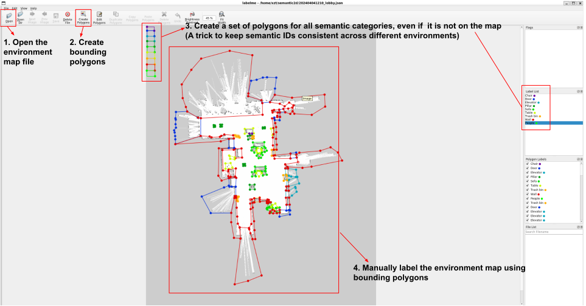
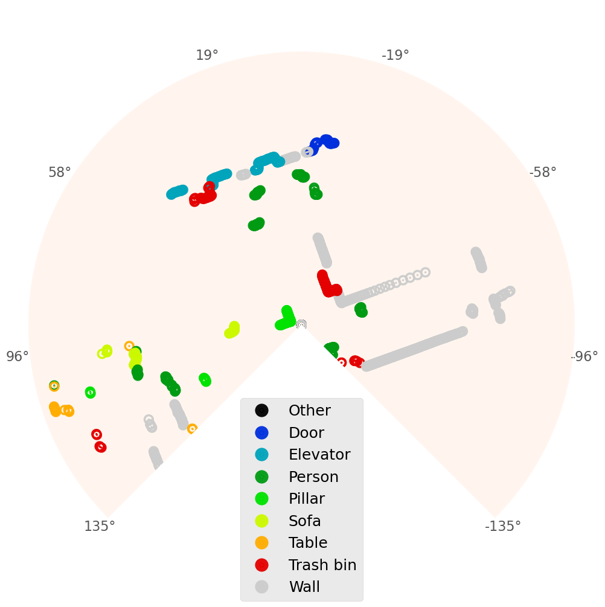

# Semantic2D: Enabling Semantic Scene Understanding with 2D Lidar Alone

Implementation code for our paper ["Semantic2D: Enabling Semantic Scene Understanding with 2D Lidar Alone"](https://arxiv.org/pdf/2409.09899).
Video demos can be found at [multimedia demonstrations](https://youtu.be/P1Hsvj6WUSY).
The Semantic2D dataset can be found and downloaded at: https://doi.org/10.5281/zenodo.18350696.

---

## Related Resources

- **Dataset Download:** https://doi.org/10.5281/zenodo.18350696
- **SALSA (Dataset and Labeling Framework):** https://github.com/TempleRAIL/semantic2d
- **S3-Net (Stochastic Semantic Segmentation):** https://github.com/TempleRAIL/s3_net
- **Semantic CNN Navigation:** https://github.com/TempleRAIL/semantic_cnn_nav

## Table of Contents

1. [Requirements](#requirements)
2. [Installation](#installation)
3. [Dataset Description](#semantic2d-dataset-description)
4. [Semi-Automatic Labeling (SALSA)](#semi-automatic-labeling-usage)
   - [Step 1: Data Collection](#step-1-data-collection)
   - [Step 2: Manual Labeling](#step-2-manual-labeling)
   - [Step 3: Automatic Labeling](#step-3-automatic-labeling)
5. [Customizing for Different LiDAR Sensors](#customizing-for-different-lidar-sensors)
6. [Visualization](#visualization)
7. [Citation](#citation)

---

## Requirements

- Ubuntu 20.04
- ROS Noetic
- Python 3.8
- Labelme
- scikit-learn
- tqdm
- PyTorch
- NumPy
- Pillow

---

## Installation

```bash
# Clone the repository
git clone https://github.com/TempleRAIL/semantic2d.git
cd semantic2d

# Install Python dependencies
pip install labelme scikit-learn tqdm torch numpy pillow

# Install LabelMe configuration with pre-defined semantic classes
cp salsa/manually_labeling/.labelmerc ~/.labelmerc
```

---

## Semantic2D Dataset Description

The dataset contains the following data types:

| Folder | Description | Shape |
|--------|-------------|-------|
| `scans_lidar/` | 2D LiDAR range data | (N,) array |
| `intensities_lidar/` | 2D LiDAR intensity data | (N,) array |
| `line_segments/` | Extracted line segments | List of [x1,y1,x2,y2] |
| `positions/` | Robot position in map frame | (3,) array [x, y, yaw] |
| `velocities/` | Robot velocity commands | (2,) array [Vx, Wz] |
| `semantic_label/` | Point-wise semantic labels | (N,) array |

### Semantic Classes

| ID | Class | Color (RGB) |
|----|-------|-------------|
| 0 | Other/Background | - |
| 1 | Chair | (109, 0, 156) |
| 2 | Door | (0, 46, 221) |
| 3 | Elevator | (0, 164, 187) |
| 4 | Person | (204, 204, 204) |
| 5 | Pillar | (0, 155, 18) |
| 6 | Sofa | (0, 225, 0) |
| 7 | Table | (203, 249, 0) |
| 8 | Trash bin | (255, 173, 0) |
| 9 | Wall | (227, 0, 0) |

---

## Semi-Automatic Labeling Usage

SALSA (Semi-Automatic Labeling framework for Semantic Annotation) consists of three steps:

---

### Step 1: Data Collection

Collect and save data from a rosbag file. **Prerequisites:** You should have already created an environment map using a mapping package (e.g., `gmapping`) and collected raw rosbag data.

#### 1.1 Configure Data Collection

Edit `salsa/manually_labeling/dataset_collection.py`:

```python
################ CUSTOMIZATION REQUIRED ################

# Number of LiDAR points (must match your sensor)
POINTS = 1081  # Hokuyo: 1081, WLR-716: 811, RPLIDAR-S2: 1972

# Output directory for collected data
DATA_PATH = "~/semantic2d_data/2024-04-11-15-24-29"
```

#### 1.2 Configure Line Extraction Launch File

The `laser_line_extraction` package extracts line features from LiDAR scans for ICP alignment. **You must configure it for your LiDAR sensor.**

Edit `salsa/manually_labeling/semantic_data_collection_ws/src/laser_line_extraction/launch/example.launch`:

```xml
<launch>
  <node name="line_extractor" pkg="laser_line_extraction" type="line_extraction_node">
    <!--################ CUSTOMIZATION REQUIRED ################-->

    <!-- LiDAR frame ID (from your URDF or tf tree) -->
    <param name="~frame_id" value="rear_laser" />

    <!-- LiDAR scan topic name -->
    <param name="~scan_topic" value="scan" />

    <!-- Sensor range parameters (must match your LiDAR) -->
    <param name="~min_range" value="0.6" />
    <param name="~max_range" value="60.0" />

    <!--################ Usually no changes needed below ################-->
    <param name="~frequency" value="30.0" />
    <param name="~publish_markers" value="false" />
    <param name="~bearing_std_dev" value="1e-5" />
    <param name="~range_std_dev" value="0.02" />
    <param name="~least_sq_angle_thresh" value="0.0001" />
    <param name="~least_sq_radius_thresh" value="0.0001" />
    <param name="~max_line_gap" value="1.0" />
    <param name="~min_line_length" value="0.4" />
    <param name="~min_split_dist" value="0.04" />
    <param name="~outlier_dist" value="0.06" />
    <param name="~min_line_points" value="15" />
  </node>
</launch>
```

**Key parameters to change:**

| Parameter | Description | Example Values |
|-----------|-------------|----------------|
| `frame_id` | TF frame of your LiDAR | `laser`, `base_scan`, `rear_laser`, `rplidar_link` |
| `scan_topic` | ROS topic for LiDAR scans | `scan`, `/scan`, `/rplidar/scan` |
| `min_range` | Minimum valid range (m) | Hokuyo: 0.1, WLR-716: 0.15, RPLIDAR: 0.2 |
| `max_range` | Maximum valid range (m) | Hokuyo: 60.0, WLR-716: 25.0, RPLIDAR: 30.0 |

**How to find your frame_id:**
```bash
# Method 1: From rostopic
rostopic echo /scan --noarr -n 1 | grep frame_id

# Method 2: From tf tree
rosrun tf view_frames  # Creates frames.pdf
```

#### 1.3 Configure ROS Topics for Data Collection

The default ROS topic subscriptions in `dataset_collection.py` are:

| Topic | Message Type | Description |
|-------|--------------|-------------|
| `scan` | `sensor_msgs/LaserScan` | LiDAR scan data |
| `line_segments` | `laser_line_extraction/LineSegmentList` | Line features |
| `bluetooth_teleop/cmd_vel` | `geometry_msgs/Twist` | Velocity commands |
| `robot_pose` | `geometry_msgs/PoseStamped` | Robot pose |

**To customize for your robot**, modify the subscribers in `dataset_collection.py`:

```python
# Example: For Hokuyo UTM-30LX-EW lidar
self.scan_sub = rospy.Subscriber("/scan", LaserScan, self.scan_callback)
self.dwa_cmd_sub = rospy.Subscriber('/cmd_vel', Twist, self.dwa_cmd_callback)
self.robot_pose_pub = rospy.Subscriber('/amcl_pose', PoseWithCovarianceStamped, self.robot_pose_callback)

# Example: For custom robot with namespaced topics
self.scan_sub = rospy.Subscriber("/my_robot/laser/scan", LaserScan, self.scan_callback)
```

#### 1.4 Run Data Collection

```bash
# Terminal 1: Start ROS master
roscore

# Terminal 2: Compile and launch line extraction
cd salsa/manually_labeling/semantic_data_collection_ws
catkin_make
source devel/setup.bash
roslaunch laser_line_extraction example.launch

# Terminal 3: Start data collection
cd salsa/manually_labeling
python dataset_collection.py

# Terminal 4: Play rosbag
rosbag play your_data.bag
```

#### 1.5 Generate Train/Dev/Test Splits

After data collection, generate index files (`train.txt`, `dev.txt`, `test.txt`) that define the dataset splits.

**Configure** `salsa/manually_labeling/generateTrainDevSet.py`:

```python
################ CUSTOMIZATION REQUIRED ################
# The path of your dataset folder:
train_folder = '~/semantic2d_data/2024-04-11-15-24-29'

# Split percentages (must sum to 1.0)
TRAIN_RATIO = 0.70  # 70% for training
DEV_RATIO = 0.10    # 10% for validation/development
TEST_RATIO = 0.20   # 20% for testing
########################################################
```

**Run the script:**

```bash
cd salsa/manually_labeling
python generateTrainDevSet.py
```

**Example output:**
```
Dataset folder: /home/user/semantic2d_data/2024-04-11-15-24-29
Total samples: 20427
Split ratios: Train=70%, Dev=10%, Test=20%
Split sizes:  Train=14298, Dev=2042, Test=4087

Generated split files:
  - /home/user/.../train.txt
  - /home/user/.../dev.txt
  - /home/user/.../test.txt
Done!
```

The script automatically:
- Counts total samples in the `positions/` folder
- Calculates split sizes based on the defined ratios
- Shuffles data randomly before splitting
- Generates the three `.txt` files with sample filenames

---

### Step 2: Manual Labeling

Use LabelMe to manually label the environment map with semantic classes.

#### 2.1 Run LabelMe

```bash
labelme

# Optionally, use RViz to visualize RGB images while labeling:
roscore
rosbag play your_data.bag
rviz  # Add Image display for camera topic
```

#### 2.2 Labeling Process

1. **Open** your occupancy grid map image (`.pgm` or `.png`)
2. **Create polygons** around each object (`Ctrl+N`)
3. **Select class** from dropdown: Chair, Door, Elevator, Pillar, Sofa, Table, Trash bin, Wall
4. **DO NOT label people** - they are automatically detected as dynamic objects
5. **Save** as `.json` file

**Demo: How to use LabelMe**



**Keyboard shortcuts:**

| Shortcut | Action |
|----------|--------|
| `Ctrl+N` | Create new polygon |
| `Ctrl+S` | Save annotation |
| `Ctrl+Z` | Undo |
| `Delete` | Delete selected polygon |
| `Ctrl+E` | Edit label |
| `D` | Next image |
| `A` | Previous image |

#### 2.3 Export Labeled Map

```bash
# Export to label images
labelme_export_json your_map.json -o labelme_output

# For older labelme versions:
# labelme_json_to_dataset your_map.json -o labelme_output
```

**Output structure** (see [labelme_output](./salsa/manually_labeling/labelme_output)):

```
labelme_output/
├── img.png           # Original map image
├── label.png         # Semantic label image (class IDs)
├── label_viz.png     # Colored visualization
└── label_names.txt   # Class name list
```

---

### Step 3: Automatic Labeling

Use ICP-based scan matching to automatically transfer labels from the map to each LiDAR scan.

#### 3.1 Configure Automatic Labeling

Edit `salsa/automatic_labeling/semi_automated_labeling_framework.py`:

```python
################ CUSTOMIZATION REQUIRED ################

# Dataset paths
DATASET_ODIR = "/home/user/semantic2d_data/2024-04-04-12-16-41"
DATASET_NAME = "train"  # Options: train, dev, test

# Map parameters (from your_map.yaml file)
MAP_ORIGIN = np.array([-21.200000, -34.800000, 0.000000])  # [x, y, theta]
MAP_RESOLUTION = 0.025000  # meters per pixel

# Labeled map paths (from Step 2)
MAP_LABEL_PATH = '../manually_labeling/labelme_output/label.png'
MAP_PATH = '../manually_labeling/labelme_output/img.png'

# LiDAR sensor parameters (see Customization section below)
POINTS = 1081
AGNLE_MIN = -2.356194496154785  # -135 degrees in radians
AGNLE_MAX = 2.356194496154785   # +135 degrees in radians
RANGE_MAX = 60.0

# URDF: LiDAR to base_link transformation
JOINT_XYZ = [-0.12, 0.0, 0.0]   # [x, y, z] translation
JOINT_RPY = [0.0, 0.0, 0.0]     # [roll, pitch, yaw] rotation
```

#### 3.2 Run Automatic Labeling

```bash
cd salsa/automatic_labeling
python semi_automated_labeling_framework.py
```

**What the algorithm does:**
1. For each LiDAR scan:
   - Extract line features (stable structures like walls)
   - Use ICP to refine robot pose alignment with the map
   - Project LiDAR points to map coordinates
   - Match each point to semantic labels via pixel lookup
   - Points in free space → labeled as "Person" (dynamic objects)

---

## Customizing for Different LiDAR Sensors

### Supported Sensor Configurations

The code includes pre-configured parameters for three sensors:

| Parameter | Hokuyo UTM-30LX-EW | WLR-716 | RPLIDAR-S2 |
|-----------|-------------------|---------|------------|
| `POINTS` | 1081 | 811 | 1972 |
| `ANGLE_MIN` (rad) | -2.356 (-135°) | -2.356 (-135°) | -3.142 (-180°) |
| `ANGLE_MAX` (rad) | 2.356 (+135°) | 2.356 (+135°) | 3.142 (+180°) |
| `RANGE_MIN` (m) | 0.1 | 0.15 | 0.2 |
| `RANGE_MAX` (m) | 60.0 | 25.0 | 30.0 |
| `JOINT_XYZ` | [-0.12, 0, 0] | [0.065, 0, 0.182] | [0.065, 0, 0.11] |
| `JOINT_RPY` | [0, 0, 0] | [3.14, 0, 0] | [0, 0, 3.14] |
| `frame_id` (launch) | `rear_laser` | `wlr716_link` | `rplidar_link` |
| `scan_topic` (launch) | `scan` | `/wj716_base/scan` | `/rplidar_base/scan` |

### How to Configure Your Own Sensor

#### Method 1: From ROS Topic

```bash
# Get sensor parameters from ROS
rostopic echo /scan --noarr -n 1

# Output shows:
# angle_min: -2.356...
# angle_max: 2.356...
# angle_increment: 0.00436...
# range_max: 60.0
# ranges: <array with N elements>
```

#### Method 2: Calculate from Specifications

```python
import numpy as np

# From your sensor datasheet
fov_degrees = 270           # Field of view
angular_resolution = 0.25   # Degrees per point

# Calculate parameters
points = int(fov_degrees / angular_resolution) + 1  # = 1081
angle_min = -np.radians(fov_degrees / 2)  # = -2.356
angle_max = np.radians(fov_degrees / 2)   # = +2.356
```

### URDF Transformation (JOINT_XYZ, JOINT_RPY)

Find the LiDAR mounting position from your robot's URDF file:

```xml
<!-- In your robot.urdf -->
<joint name="laser_joint" type="fixed">
  <origin xyz="-0.12 0.0 0.0" rpy="0 0 0"/>
  <parent link="base_link"/>
  <child link="laser_frame"/>
</joint>
```

```python
# Use these values in the config
JOINT_XYZ = [-0.12, 0.0, 0.0]  # From xyz attribute
JOINT_RPY = [0.0, 0.0, 0.0]    # From rpy attribute
```

### Complete Example: Adding a New Sensor

In `semi_automated_labeling_framework.py`:

```python
################ CUSTOMIZATION REQUIRED ################

# Comment out existing configuration
# # Hokuyo UTM-30LX-EW:
# POINTS = 1081
# AGNLE_MIN = -2.356194496154785
# ...

# Add YOUR sensor configuration:
# SICK TiM561:
POINTS = 811              # From rostopic echo /scan
AGNLE_MIN = -2.356        # -135 degrees
AGNLE_MAX = 2.356         # +135 degrees
RANGE_MAX = 10.0          # 10 meters

# URDF transformation (from robot model)
JOINT_XYZ = [0.15, 0.0, 0.2]   # Mounted 15cm forward, 20cm up
JOINT_RPY = [0.0, 0.0, 0.0]    # No rotation
```

### Modifying Data Collection for Your Robot

In `dataset_collection.py`:

```python
################ CUSTOMIZATION REQUIRED ################

# 1. Set number of points for your sensor
POINTS = 811  # Your sensor's point count

# 2. Set output directory
DATA_PATH = "~/my_robot_data/environment_1"

# 3. Modify ROS subscribers for your topics (in __init__):

# Original (Jackal robot):
self.scan_sub = rospy.Subscriber("scan", LaserScan, self.scan_callback)
self.dwa_cmd_sub = rospy.Subscriber('bluetooth_teleop/cmd_vel', Twist, self.dwa_cmd_callback)
self.robot_pose_pub = rospy.Subscriber('robot_pose', PoseStamped, self.robot_pose_callback)

# For YOUR robot (example):
self.scan_sub = rospy.Subscriber("/my_robot/scan", LaserScan, self.scan_callback)
self.dwa_cmd_sub = rospy.Subscriber('/my_robot/cmd_vel', Twist, self.dwa_cmd_callback)
self.robot_pose_pub = rospy.Subscriber('/amcl_pose', PoseWithCovarianceStamped, self.robot_pose_callback)
```

### Quick Reference: Files to Modify

| Task | File | Parameters to Change |
|------|------|---------------------|
| Line Extraction | `salsa/manually_labeling/semantic_data_collection_ws/src/laser_line_extraction/launch/example.launch` | `frame_id`, `scan_topic`, `min_range`, `max_range` |
| Data Collection | `salsa/manually_labeling/dataset_collection.py` | `POINTS`, `DATA_PATH`, ROS topics |
| Dataset Splits | `salsa/manually_labeling/generateTrainDevSet.py` | `train_folder`, `TRAIN_RATIO`, `DEV_RATIO`, `TEST_RATIO` |
| Manual Labeling | `~/.labelmerc` | Label names/colors (optional) |
| Auto Labeling | `salsa/automatic_labeling/semi_automated_labeling_framework.py` | `DATASET_ODIR`, `MAP_*`, `POINTS`, `ANGLE_*`, `JOINT_*` |
| Visualization | `salsa/automatic_labeling/draw_semantic_label_sample.py` | `DATASET_ODIR`, `POINTS`, `ANGLE_*` |

### Launch File Configurations for Different Sensors

**Hokuyo UTM-30LX-EW (Jackal robot):**
```xml
<param name="~frame_id" value="rear_laser" />
<param name="~scan_topic" value="scan" />
<param name="~min_range" value="0.1" />
<param name="~max_range" value="60.0" />
```

**WLR-716 (Custom robot):**
```xml
<param name="~frame_id" value="wlr716_link" />
<param name="~scan_topic" value="/wj716_base/scan" />
<param name="~min_range" value="0.15" />
<param name="~max_range" value="25.0" />
```

**RPLIDAR-S2 (Custom robot):**
```xml
<param name="~frame_id" value="rplidar_link" />
<param name="~scan_topic" value="/rplidar_base/scan" />
<param name="~min_range" value="0.2" />
<param name="~max_range" value="30.0" />
```

---

## Visualization

Plot the labeled semantic LiDAR data:

```bash
# Configure the same sensor parameters in draw_semantic_label_sample.py
cd salsa/automatic_labeling
python draw_semantic_label_sample.py
```




---

## Citation

```bibtex
@article{xie2026semantic2d,
  title={Semantic2D: Enabling Semantic Scene Understanding with 2D Lidar Alone},
  author={Xie, Zhanteng and Pan, Yipeng and Zhang, Yiqiang and Pan, Jia and Dames, Philip},
  journal={arXiv preprint arXiv:2409.09899},
  year={2026}
}
```


