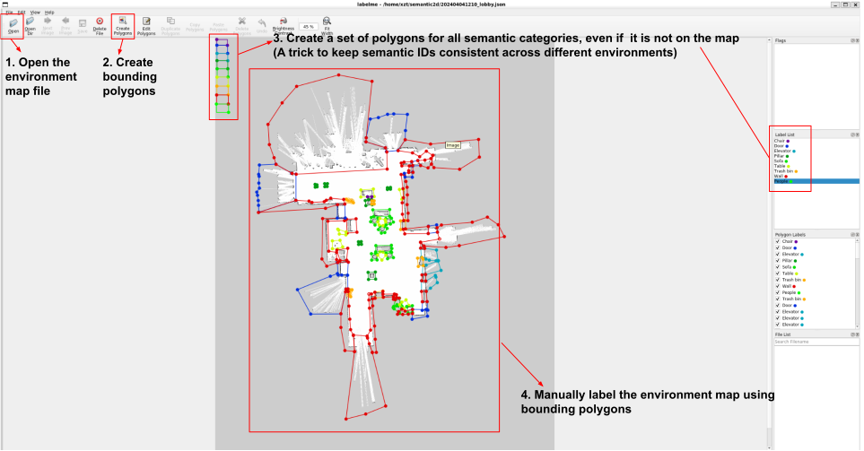

# Semantic2D: A Semantic Dataset for 2D Lidar Semantic Segmentation
Implementation code for our paper ["Semantic2D: A Semantic Dataset for 2D Lidar Semantic Segmentation"](https://arxiv.org/pdf/2409.09899). 
Video demos can be found at [multimedia demonstrations](https://youtu.be/a6Xl00loInY).
The Semantic2D dataset can be found and downloaded at: https://doi.org/10.5281/zenodo.13730200. 

## Requirements:
* Ubuntu 20.04
* ROS-Noetic
* Python 3.8
* Labelme 

## Installation:
Install Labelme package: 
```
git clone https://github.com/TempleRAIL/semantic2d.git
cd  semantic2d
pip install labelme
cp manually_labeling/.labelmerc ~/.labelmerc
```
## Semantic2D Dataset Description:
* ``scans_lidar": each *.npy file contains a 1081x1 array 2D lidar range data
* ``intensities_lidar": each *.npy file contains 1081x1 array 2D lidar intensity data
* ``line_segments": each *.npy file contains a point list of line segments in the 2D lidar data
* ``positions": each *.npy file contains a 3x1 robot position data (x, y, z)
* ``velocities": each *.npy file contains a 2x1 robot velocity data (Vx, Wz)

## Semi-Automatic Labeling Usage: 
*  Dataset Collection: collect and save the data from the rosbag file: assume you have already created the environment map using a mapping package like amcl and collected the raw rosbag data "xx.bag" 
```
# complie the workspace:
cd manually_labeling/semantic_data_collection_ws
catkin_make
source devel/setup.sh
# read the rosbag and collect and save the data:
roslaunch laser_line_extraction example.launch
rosbag play xx.bag
cd manually_labeling
python dataset_collection.py
```

*  Manually Labeling: use the Labelme tool to manually label the environment map, as shown in 
 

You will then get an environment map image and its semantically labeled map image, as shown in [labelme_output](./manually_labeling/labelme_output).

*  Automatic Labeling: 
Please modify the following configuration in the [semi_automated_labeling_framework.py](./automatic_labeling/semi_automated_labeling_framework.y) according to your robot and environment configuration:
```
# dataset: 
DATASET_ODIR = "/home/xzt/data/semantic_lidar_v2/2024-04-04-12-16-41"  # the directory path of the raw data
DATASET_NAME = "train" # select the train, dev, and test 
# map: parameters from the map configuration file
MAP_ORIGIN = np.array([-21.200000, -34.800000, 0.000000]) 
MAP_RESOLUTION = 0.025000
# labeling:
MAP_LABEL_PATH = '../manually_labeling/labelme_output/label.png'
MAP_PATH = '../manually_labeling/labelme_output/img.png'
# lidar sensor:
POINTS = 1081 # the number of lidar points
LIDAR_BASE_DIS = -0.12 # the distance from lidar_mount to base_link
```

Start the automatic labeling:
```
cd ../automatic_labeling
python semi_automated_labeling_framework.py
```

Plot the labeled semantic lidar data: you also need to modify the similar configuration as [semi_automated_labeling_framework.py](./automatic_labeling/semi_automated_labeling_framework.y) in the [draw_semantic_label_sample.py](./automatic_labeling/draw_semantic_label_sample.y) 
```
python draw_semantic_label_sample.py
```
 


## Citation
```
@article{xie2024semantic2d,
  title={Semantic2D: A Semantic Dataset for 2D Lidar Semantic Segmentation},
  author={Xie, Zhanteng and Dames, Philip},
  journal={arXiv preprint arXiv:2409.09899},
  year={2024}
}
```