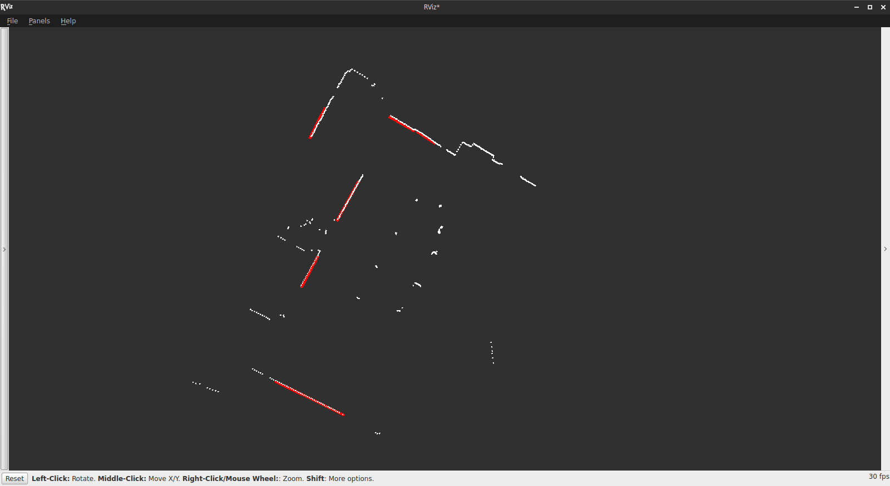

# Laser Line Extraction
Laser Line Extraction is a [Robot Operating System (ROS)](http://www.ros.org) package that extracts line segments form [LaserScan](http://docs.ros.org/api/sensor_msgs/html/msg/LaserScan.html) messages. Created by [Marc Gallant](http://marcgallant.ca), originally for use in the [Mining Systems Laboratory](http://msl.engineering.queensu.ca). Here is what the Laser Line Extraction package looks like in action:



In the above image, the white dots are points in a LaserScan message, and the red lines are what is extracted by Laser Line Extraction. This data was collected by driving a robot through Beamish-Munro Hall at Queen's University. A SICK LMS111 laser scanner was mounted to the robot. The extraction algorithm is very configurable; the above image used the parameters configured in the `example.launch` launch file.

After applying some filters to remove outlying points, Laser Line Extraction implements a split-and-merge algorithm to determine which points belong to lines. Next, it implements the weighted line fitting algorithm by Pfister *et al.* [1] to find the best fit lines and their respective covariance matrices.

## Usage
I recommend making a copy of `example.launch` in the launch directory and configuring the parameters until you reach a desirable outcome. The parameters in `example.launch` are a good starting point. Then simply use roslaunch, e.g.,

```
roslaunch laser_line_extraction example.launch
```

## Messages
Laser Line Extraction has two messages types:

#### LineSegment.msg
```
float32 radius
float32 angle
float32[4] covariance
float32[2] start
float32[2] end
```
`radius` (m) and `angle` (rad) are the polar parameterization of the line segment. `covariance` is the 2x2 covariance matrix of `radius` and `angle` (listed in row-major order). Finally `start` and `end` are the (x, y) coordinates of the start and end of the line segment.

#### LineSegmentList.msg
```
Header header
LineSegment[] line_segments
```
An array of LineSegment.msg with a header.

## Topics

Laser Line Extraction subscribes to a single topic and publishes one or two topics.

### Subscribed topics
- `/scan` ([sensor_msgs/LaserScan](http://docs.ros.org/api/sensor_msgs/html/msg/LaserScan.html))
	- The name of this topic can be configured (see Parameters).

### Published topics
- `/line_segments` (laser\_line\_extraction/LineSegmentList)
	- A list of line segments extracted from a laser scan.
- `/line_markers` ([visualization_msgs/Marker](http://docs.ros.org/api/visualization_msgs/html/msg/Marker.html))
	- (optional) Markers so that the extracted lines can be visualized in rviz (see above image). Can be toggled (see Parameters).

## Parameters
The parameters are listed in alphabetical order.

- `bearing_std_dev` (default: 0.001)
	- The standard deviation of bearing uncertainty in the laser scans (rad).
- `frame_id` (default: "laser")
	- The frame in which the line segments are published.
- `least_sq_angle_thresh` (default: 0.0001)
	- Change in angle (rad) threshold to stop iterating least squares (`least_sq_radius_thresh` must also be met).
- `least_sq_radius_thresh` (default: 0.0001)
	- Change in radius (m) threshold to stop iterating least squares (`least_sq_angle_thresh` must also be met).
- `max_line_gap` (default: 0.4)
	- The maximum distance between two points in the same line (m).
- `min_line_length` (default: 0.5)
	- Lines shorter than this are not published (m).
- `min_line_points` (default: 9)
	- Lines with fewer points than this are not published.
- `min_range` (default: 0.4)
	- Points closer than this are ignored (m).
- `max_range` (default: 10000.0)
	- Points farther than this are ignored (m).
- `min_split_dist` (default: 0.05)
	- When performing "split" step of split and merge, a split between two points results when the two points are at least this far apart (m).
- `outlier_dist` (default: 0.05)
	- Points who are at least this distance from all their neighbours are considered outliers (m).
- `publish_markers` (default: false)
	- Whether or not markers are published.
- `range_std_dev` (default: 0.02)
	- The standard deviation of range uncertainty in the laser scans (m).
- `scan_topic` (default: "scan")
	- The LaserScan topic.

## References
[1] S. T. Pfister, S. I. Roumeliotis, and J. W. Burdick, "Weighted line fitting algorithms for mobile robot map building and efficient data representation" in Proc. IEEE Intl. Conf. on Robotics and Automation (ICRA), Taipei, Taiwan, 14-19 Sept., 2003. 
